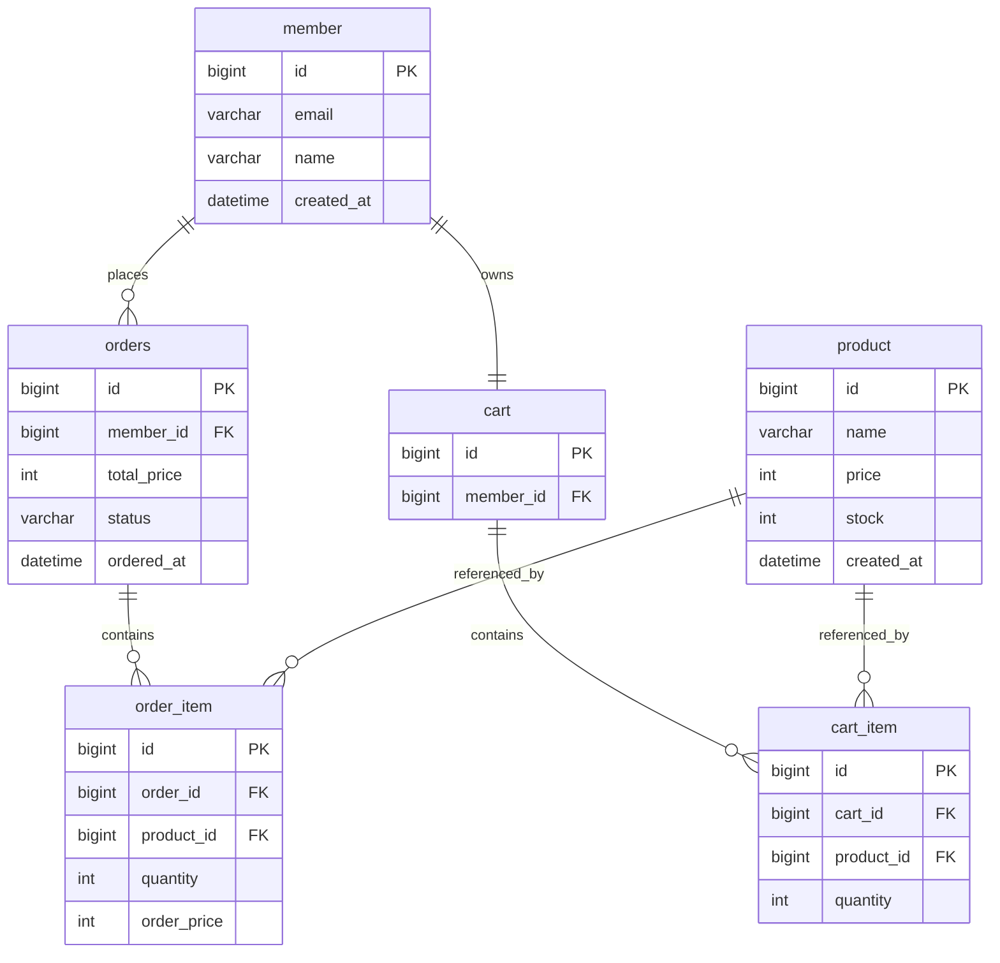

# nabom-market

> 작고 단단한 쇼핑몰 백엔드 API

Spring Boot와 MyBatis로 구현하는 쇼핑몰 서비스 백엔드입니다.
상품 조회 → 장바구니 → 주문 생성으로 이어지는 커머스의 핵심 흐름을 다루며,
**주문 트랜잭션의 원자성**, **재고 정합성**, **SQL 레벨의 조회 최적화**를 주요 관심사로 삼았습니다.

<br>

## 왜 만들었나

기능을 넓게 붙이는 대신, 커머스에서 가장 까다로운 지점 하나를 깊게 파는 것을 목표로 했습니다.

주문 생성은 겉보기엔 단순한 INSERT지만 실제로는 여러 조건이 동시에 성립해야 합니다.
재고가 충분해야 하고, 재고 차감과 주문 저장이 하나의 트랜잭션으로 묶여야 하며,
주문 시점의 가격이 이후의 상품 가격 변동과 무관하게 보존되어야 합니다.

ORM 대신 MyBatis를 선택한 것도 같은 맥락입니다.
쿼리가 코드에 그대로 드러나기 때문에 어떤 SQL이 언제 몇 번 나가는지를 직접 통제할 수 있고,
재고 차감 같은 정합성 문제를 SQL 수준에서 다루는 연습이 됩니다.

<br>

## 기술 스택

| 구분 | 사용 기술 |
|---|---|
| Language | Java 21 (toolchain) |
| Framework | Spring Boot 4.1.1 |
| Web | Spring Web MVC |
| Security | Spring Security |
| Persistence | MyBatis 3 |
| Database | MySQL 8 |
| Migration | Flyway (`flyway-mysql`) |
| Docs | springdoc-openapi 3.1 (Swagger UI) |
| Build | Gradle 9.7.1 (Kotlin DSL) |
| Monitoring | Spring Boot Actuator |
| Test | JUnit 5, Testcontainers (MySQL) |
| Infra | Docker Compose (`spring-boot-docker-compose`) |

<br>

## 설정 메모

Initializr 기본 생성물에서 조정한 부분과 그 이유입니다.

**라이브러리 버전은 Boot 4 기준으로 고정**

Spring Boot BOM이 관리하지 않는 두 라이브러리는 `build.gradle.kts`에 버전을 직접 적었습니다.
계열을 잘못 고르면 기동 시점에 깨지므로 주의가 필요합니다.

| 라이브러리 | 사용 버전 | 주의 |
|---|---|---|
| mybatis-spring-boot-starter | `4.1.0` | 널리 쓰이는 `3.0.x`는 Boot 3.2~3.5 전용 |
| springdoc-openapi-starter-webmvc-ui | `3.1.1` | `2.x`는 Boot 3 전용 |

**Security는 전 경로 개방 상태**

Spring Security는 클래스패스에 존재하는 것만으로 모든 엔드포인트를 잠급니다.
인증을 마지막 단계에 붙일 예정이므로 `common/config/SecurityConfig`에서 전부 열어 두었습니다.
JWT 도입 시 이 클래스를 교체합니다.

**DataSource 설정을 적지 않는 이유**

`spring-boot-docker-compose`가 `compose.yaml`을 읽어 접속 정보를 주입하므로
`application.yml`에 `spring.datasource.*`가 없습니다.

**컨테이너 이미지 태그 고정**

`compose.yaml`과 Testcontainers 모두 `mysql:latest` 대신 `mysql:8.4`를 사용합니다.
`latest`는 시점에 따라 다른 메이저 버전이 내려올 수 있습니다.

## 구현 현황

**상품**

- [ ] 상품 등록 / 수정 / 삭제
- [ ] 상품 단건 조회
- [ ] 상품 목록 조회 (페이징)

**장바구니**

- [ ] 장바구니 담기
- [ ] 장바구니 조회
- [ ] 수량 변경
- [ ] 항목 삭제

**주문**

- [ ] 장바구니 기반 주문 생성 (재고 차감 + 총액 계산)
- [ ] 주문 목록 / 단건 조회
- [ ] 주문 취소 (재고 복구)

**공통**

- [ ] 전역 예외 처리 (`@RestControllerAdvice`)
- [ ] 요청 값 검증 (`@Valid`)
- [ ] Flyway 마이그레이션 스크립트
- [ ] Swagger 문서화

<br>

## 데이터 모델



### 설계 노트

**`order_item.order_price` — 주문 시점 가격의 스냅샷**

주문 항목은 상품을 참조하면서도 가격을 별도 컬럼으로 복사해 보관합니다.
상품 가격이 이후에 변경되더라도 과거 주문의 결제 금액은 그대로 유지되어야 하기 때문입니다.
조회 시점에 `product`를 조인해 가격을 읽어오는 방식은 이 요구사항을 만족시키지 못합니다.

**재고 차감은 조건부 UPDATE로**

`SELECT`로 재고를 확인한 뒤 `UPDATE`하는 방식은 두 쿼리 사이에 다른 주문이 끼어들 수 있습니다.
검사와 차감을 한 문장으로 합치고, 영향받은 행 수로 성공 여부를 판단합니다.

```sql
UPDATE product
   SET stock = stock - #{quantity}
 WHERE id = #{productId}
   AND stock >= #{quantity}
```

반환값이 `0`이면 재고가 부족했다는 뜻이므로 예외를 던져 트랜잭션을 롤백합니다.
단일 문장이므로 InnoDB의 행 잠금만으로 경쟁 조건이 해소되고, 별도의 락을 잡을 필요가 없습니다.

**주문 상태**

`PENDING` → `PAID` → `SHIPPED` 흐름과 `CANCELLED`를 상정하되,
현재 범위에서는 `PENDING`과 `CANCELLED`만 사용합니다.

**테이블명 `orders`**

`ORDER`는 SQL 예약어이므로 복수형을 씁니다.

<br>

## API

인증은 아직 도입 전이며, 임시로 `X-MEMBER-ID` 헤더로 사용자를 식별합니다.

### 상품

| Method | Endpoint | 설명 |
|---|---|---|
| `GET` | `/api/v1/products` | 상품 목록 조회 |
| `GET` | `/api/v1/products/{id}` | 상품 단건 조회 |
| `POST` | `/api/v1/products` | 상품 등록 |
| `PUT` | `/api/v1/products/{id}` | 상품 수정 |
| `DELETE` | `/api/v1/products/{id}` | 상품 삭제 |

### 장바구니

| Method | Endpoint | 설명 |
|---|---|---|
| `GET` | `/api/v1/cart` | 장바구니 조회 |
| `POST` | `/api/v1/cart/items` | 장바구니에 상품 담기 |
| `PATCH` | `/api/v1/cart/items/{itemId}` | 수량 변경 |
| `DELETE` | `/api/v1/cart/items/{itemId}` | 항목 삭제 |

### 주문

| Method | Endpoint | 설명 |
|---|---|---|
| `POST` | `/api/v1/orders` | 장바구니 기반 주문 생성 |
| `GET` | `/api/v1/orders` | 주문 목록 조회 |
| `GET` | `/api/v1/orders/{id}` | 주문 상세 조회 |
| `POST` | `/api/v1/orders/{id}/cancel` | 주문 취소 |

### 에러 응답 포맷

모든 에러는 아래 형태로 통일해 반환합니다.

```json
{
  "code": "OUT_OF_STOCK",
  "message": "재고가 부족합니다. (요청: 5, 잔여: 2)",
  "timestamp": "2026-09-10T14:32:05"
}
```

| 상황 | 상태 코드 | 코드 |
|---|---|---|
| 요청 값 검증 실패 | `400` | `INVALID_REQUEST` |
| 리소스 없음 | `404` | `NOT_FOUND` |
| 재고 부족 | `409` | `OUT_OF_STOCK` |
| 취소 불가한 주문 | `409` | `INVALID_ORDER_STATUS` |

<br>

## 실행 방법

Docker Desktop이 실행 중이어야 합니다.

```bash
./gradlew bootRun
```

`spring-boot-docker-compose`가 포함되어 있어 애플리케이션 기동 시
`compose.yaml`의 MySQL 컨테이너가 자동으로 올라오고 접속 정보가 주입됩니다.
`docker compose up`을 따로 실행할 필요가 없습니다.

이어서 Flyway가 `src/main/resources/db/migration`의 스크립트를 순서대로 적용해
스키마를 생성하고 샘플 데이터를 적재합니다.

| 항목 | 주소 |
|---|---|
| API 서버 | http://localhost:8080 |
| Actuator | http://localhost:8080/actuator/health |
| Swagger UI | http://localhost:8080/swagger-ui.html |

### 테스트

```bash
./gradlew test
```

Testcontainers가 테스트 전용 MySQL 컨테이너를 띄웁니다.
`TestNabomMarketApplication`으로 실행하면 Testcontainers 기반 DB로 애플리케이션을 구동할 수 있습니다.

<br>

## 패키지 구조

계층(`controller`, `service`, `mapper`)이 아닌 **도메인 단위**로 패키지를 나눕니다.
계층별 분리는 도메인이 늘어날수록 하나의 기능을 수정할 때 여러 패키지를 오가게 만들기 때문입니다.

```
src/main/java/com/example/nabom_market
├── NabomMarketApplication.java
├── product
│   ├── Product.java
│   ├── ProductController.java
│   ├── ProductService.java
│   ├── ProductMapper.java        # @Mapper 인터페이스
│   └── dto
├── cart
├── order
├── member
└── common
    ├── exception                 # 커스텀 예외, GlobalExceptionHandler
    ├── response                  # 공통 응답 포맷
    └── config                    # Security, MyBatis, Swagger 설정

src/main/resources
├── mapper                        # Mapper XML
│   ├── ProductMapper.xml
│   ├── CartMapper.xml
│   └── OrderMapper.xml
├── db/migration                  # Flyway 스크립트 (V1__init.sql ...)
└── application.yml
```

Mapper 인터페이스는 도메인 패키지에, XML은 `resources/mapper`에 두고
`mybatis.mapper-locations`로 연결합니다.
컬럼명과 필드명은 `map-underscore-to-camel-case`로 자동 매핑합니다.

<br>

## 기록해 둘 것

작업하면서 마주친 문제와 해결 과정을 남기는 공간입니다.

<!--
아래 형식으로 채워 나가면 나중에 회고하거나 면접에서 설명할 때 그대로 쓸 수 있습니다.

### 주문 상세 조회의 N+1
- 상황: 주문 목록 10건 조회에 쿼리가 11번 나감
- 원인: resultMap의 collection을 nested select로 구성
- 해결: join 기반 nested resultMap으로 변경
- 결과:
-->

<br>

## 앞으로

- [ ] Spring Security + JWT 기반 인증 도입 (`X-MEMBER-ID` 헤더 제거)
- [ ] 동시 주문 부하 테스트 — 조건부 UPDATE 방식의 재고 정합성 검증
- [ ] 상품 검색 — 동적 쿼리(`<if>`, `<foreach>`)로 다중 조건 필터
- [ ] 조회 성능 개선 — 인기 상품 Redis 캐싱
- [ ] Testcontainers 기반 Mapper 통합 테스트
- [ ] GitHub Actions CI (빌드 + 테스트)
