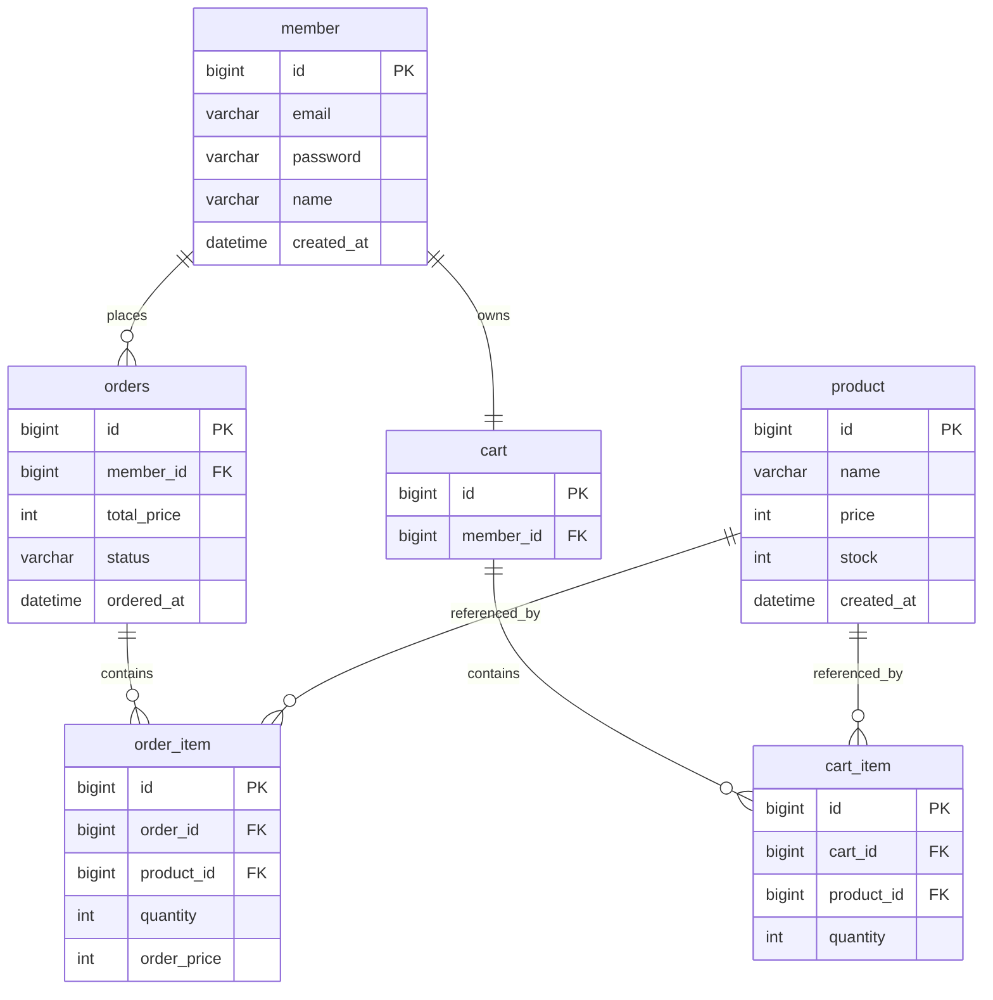

# nabom-market

> 작고 단단한 쇼핑몰 백엔드 API

Spring Boot와 MyBatis로 구현하는 쇼핑몰 서비스 백엔드입니다.
상품 조회 → 장바구니 → 주문 생성으로 이어지는 커머스의 핵심 흐름을 다루며,
**주문 트랜잭션의 원자성**, **재고 정합성**, **SQL 레벨의 조회 최적화**를 주요 관심사로 삼았습니다.

<br>

## 왜 만들었나

기능을 넓게 붙이는 대신, 커머스에서 가장 까다로운 지점 하나를 깊게 파는 것을 목표로 했습니다.

주문 생성은 겉보기엔 단순한 INSERT지만 실제로는 여러 조건이 동시에 성립해야 합니다.
재고가 충분해야 하고, 재고 차감과 주문 저장이 하나의 트랜잭션으로 묶여야 하며,
주문 시점의 가격이 이후의 상품 가격 변동과 무관하게 보존되어야 합니다.

ORM 대신 MyBatis를 선택한 것도 같은 맥락입니다.
쿼리가 코드에 그대로 드러나기 때문에 어떤 SQL이 언제 몇 번 나가는지를 직접 통제할 수 있고,
재고 차감 같은 정합성 문제를 SQL 수준에서 다루는 연습이 됩니다.

<br>

## 기술 스택

| 구분 | 사용 기술 |
|---|---|
| Language | Java 21 (toolchain) |
| Framework | Spring Boot 4.1.1 |
| Web | Spring Web MVC |
| Security | Spring Security 7 + JWT (jjwt 0.13) |
| Persistence | MyBatis 4.1 |
| Database | MySQL 8 |
| Migration | Flyway (`flyway-mysql`) |
| Docs | springdoc-openapi 3.1 (Swagger UI) |
| Build | Gradle 9.7.1 (Kotlin DSL) |
| Monitoring | Spring Boot Actuator |
| Test | JUnit 5, MockMvc, Testcontainers (MySQL) |
| Infra | Docker Compose (`spring-boot-docker-compose`) |

<br>

## 설정 메모

Initializr 기본 생성물에서 조정한 부분과 그 이유입니다.

**라이브러리 버전은 Boot 4 기준으로 고정**

Spring Boot BOM이 관리하지 않는 두 라이브러리는 `build.gradle.kts`에 버전을 직접 적었습니다.
계열을 잘못 고르면 기동 시점에 깨지므로 주의가 필요합니다.

| 라이브러리 | 사용 버전 | 주의 |
|---|---|---|
| mybatis-spring-boot-starter | `4.1.0` | 널리 쓰이는 `3.0.x`는 Boot 3.2~3.5 전용 |
| springdoc-openapi-starter-webmvc-ui | `3.1.1` | `2.x`는 Boot 3 전용 |
| jjwt | `0.13.0` | `0.12` 부터 API가 바뀌었다 (`subject()`, `expiration()`) |

한 가지 더. **Boot 4는 Jackson 3을 씁니다.** 패키지가 `com.fasterxml.jackson`에서
`tools.jackson`으로 바뀌어서, 인터넷의 Boot 3 예제를 그대로 붙이면
`ObjectMapper` 빈을 못 찾습니다.

**Security는 세션 없는 JWT 방식**

`SessionCreationPolicy.STATELESS`로 세션을 만들지 않고, 매 요청의
`Authorization: Bearer` 헤더만으로 인증합니다. 서버가 기억하는 상태가 없으므로
`JSESSIONID` 쿠키도 나가지 않습니다.

토큰 서명 키는 `JWT_SECRET` 환경변수로 주입하고, 없으면 로컬 개발용 기본값을 씁니다.
운영에서 쓸 값이 아니라는 뜻을 기본값 문자열 자체에 적어 두었습니다.

**DataSource 설정을 적지 않는 이유**

`spring-boot-docker-compose`가 `compose.yaml`을 읽어 접속 정보를 주입하므로
`application.yml`에 `spring.datasource.*`가 없습니다.

**컨테이너 이미지 태그 고정**

`compose.yaml`과 Testcontainers 모두 `mysql:latest` 대신 `mysql:8.4`를 사용합니다.
`latest`는 시점에 따라 다른 메이저 버전이 내려올 수 있습니다.

## 구현 현황

**상품**

- [x] 상품 등록 / 수정 / 삭제
- [x] 상품 단건 조회
- [x] 상품 목록 조회
- [ ] 페이징 및 검색

**장바구니**

- [x] 장바구니 담기 (같은 상품은 수량 합산)
- [x] 장바구니 조회 (상품명·단가·소계·품절 여부)
- [x] 수량 변경
- [x] 항목 삭제

**주문**

- [x] 주문 생성 — 재고 차감, 주문 시점 단가 스냅샷, 전부 성공 아니면 전부 롤백
- [x] 주문 목록 / 단건 조회
- [x] 주문 취소 — 재고 복구, 중복 취소 방지

**인증**

- [x] 회원가입 — 이메일 중복 검사, BCrypt 해시
- [x] 로그인 — JWT 액세스 토큰 발급
- [x] 토큰 검증 필터 + 인증 실패 401 응답
- [x] `@LoginMember` 로 컨트롤러에 회원 id 주입
- [ ] 리프레시 토큰 / 토큰 무효화

**공통**

- [x] 전역 예외 처리 (`ResponseEntityExceptionHandler` 기반)
- [x] 요청 값 검증 (`@Valid`)
- [x] Flyway 마이그레이션
- [x] Swagger 문서화
- [x] Testcontainers 기반 API 테스트 (인증·상품·장바구니·주문 55건)

<br>

## 데이터 모델



### 설계 노트

**`order_item.order_price` — 주문 시점 가격의 스냅샷**

주문 항목은 상품을 참조하면서도 가격을 별도 컬럼으로 복사해 보관합니다.
상품 가격이 이후에 변경되더라도 과거 주문의 결제 금액은 그대로 유지되어야 하기 때문입니다.
조회 시점에 `product`를 조인해 가격을 읽어오는 방식은 이 요구사항을 만족시키지 못합니다.

**재고 차감은 조건부 UPDATE로**

`SELECT`로 재고를 확인한 뒤 `UPDATE`하는 방식은 두 쿼리 사이에 다른 주문이 끼어들 수 있습니다.
검사와 차감을 한 문장으로 합치고, 영향받은 행 수로 성공 여부를 판단합니다.

```sql
UPDATE product
   SET stock = stock - #{quantity}
 WHERE id = #{productId}
   AND stock >= #{quantity}
```

반환값이 `0`이면 재고가 부족했다는 뜻이므로 예외를 던져 트랜잭션을 롤백합니다.
단일 문장이므로 InnoDB의 행 잠금만으로 경쟁 조건이 해소되고, 별도의 락을 잡을 필요가 없습니다.

**주문 상태**

`PENDING` → `PAID` → `SHIPPED` 흐름과 `CANCELLED`를 상정하되,
현재 범위에서는 `PENDING`과 `CANCELLED`만 사용합니다.

**테이블명 `orders`**

`ORDER`는 SQL 예약어이므로 복수형을 씁니다.

<br>

## API

로그인으로 받은 액세스 토큰을 `Authorization: Bearer <token>` 헤더에 실어 보냅니다.
아래 표의 **인증** 열이 `필요`인 엔드포인트는 토큰이 없으면 `401`로 거절됩니다.

### 인증

| Method | Endpoint | 설명 | 인증 |
|---|---|---|---|
| `POST` | `/api/v1/auth/signup` | 회원가입 | — |
| `POST` | `/api/v1/auth/login` | 로그인, 액세스 토큰 발급 | — |

```json
// POST /api/v1/auth/login 응답
{
  "accessToken": "eyJhbGciOiJIUzI1NiJ9...",
  "tokenType": "Bearer",
  "expiresIn": 3600
}
```

### 상품

| Method | Endpoint | 설명 | 인증 |
|---|---|---|---|
| `GET` | `/api/v1/products` | 상품 목록 조회 | — |
| `GET` | `/api/v1/products/{id}` | 상품 단건 조회 | — |
| `POST` | `/api/v1/products` | 상품 등록 | — |
| `PUT` | `/api/v1/products/{id}` | 상품 수정 | — |
| `DELETE` | `/api/v1/products/{id}` | 상품 삭제 | — |

쓰기 작업은 원래 관리자만 할 수 있어야 하지만, 역할(role) 개념이 아직 없어
전부 열어 둔 상태입니다.

### 장바구니

| Method | Endpoint | 설명 | 인증 |
|---|---|---|---|
| `GET` | `/api/v1/cart` | 장바구니 조회 | 필요 |
| `POST` | `/api/v1/cart/items` | 장바구니에 상품 담기 | 필요 |
| `PATCH` | `/api/v1/cart/items/{itemId}` | 수량 변경 | 필요 |
| `DELETE` | `/api/v1/cart/items/{itemId}` | 항목 삭제 | 필요 |

### 주문

| Method | Endpoint | 설명 | 인증 |
|---|---|---|---|
| `POST` | `/api/v1/orders` | 주문 생성 (항목 목록을 본문으로) | 필요 |
| `GET` | `/api/v1/orders` | 주문 목록 조회 | 필요 |
| `GET` | `/api/v1/orders/{id}` | 주문 상세 조회 | 필요 |
| `POST` | `/api/v1/orders/{id}/cancel` | 주문 취소 | 필요 |

### 에러 응답 포맷

모든 에러는 아래 형태로 통일해 반환합니다.

```json
{
  "code": "OUT_OF_STOCK",
  "message": "재고가 부족합니다. (요청: 5, 잔여: 2)",
  "timestamp": "2026-09-10T14:32:05"
}
```

| 상황 | 상태 코드 | 코드 |
|---|---|---|
| 요청 값 검증 실패 | `400` | `INVALID_REQUEST` |
| 토큰이 없거나 유효하지 않음 | `401` | `UNAUTHORIZED` |
| 리소스 없음 | `404` | `NOT_FOUND` |
| 재고 부족 | `409` | `OUT_OF_STOCK` |
| 취소 불가한 주문 | `409` | `INVALID_ORDER_STATUS` |
| 이미 가입된 이메일 | `409` | `DUPLICATE_EMAIL` |

남의 리소스에 접근하면 `403`이 아니라 `404`를 줍니다. 이유는 아래 기록에 적어 두었습니다.

<br>

## 실행 방법

Docker Desktop이 실행 중이어야 합니다.

```bash
./gradlew bootRun
```

`spring-boot-docker-compose`가 포함되어 있어 애플리케이션 기동 시
`compose.yaml`의 MySQL 컨테이너가 자동으로 올라오고 접속 정보가 주입됩니다.
`docker compose up`을 따로 실행할 필요가 없습니다.

이어서 Flyway가 `src/main/resources/db/migration`의 스크립트를 순서대로 적용해
스키마를 생성하고 샘플 데이터를 적재합니다.

| 항목 | 주소 |
|---|---|
| API 서버 | http://localhost:8080 |
| Actuator | http://localhost:8080/actuator/health |
| Swagger UI | http://localhost:8080/swagger-ui.html |

### 테스트

```bash
./gradlew test
```

Testcontainers가 테스트 전용 MySQL 컨테이너를 띄웁니다.
`TestNabomMarketApplication`으로 실행하면 Testcontainers 기반 DB로 애플리케이션을 구동할 수 있습니다.

<br>

## 패키지 구조

계층(`controller`, `service`, `mapper`)이 아닌 **도메인 단위**로 패키지를 나눕니다.
계층별 분리는 도메인이 늘어날수록 하나의 기능을 수정할 때 여러 패키지를 오가게 만들기 때문입니다.

```
src/main/java/com/example/nabom_market
├── NabomMarketApplication.java
├── product
│   ├── Product.java
│   ├── ProductController.java
│   ├── ProductService.java
│   ├── ProductMapper.java        # @Mapper 인터페이스
│   └── dto
├── cart
├── order
├── auth                          # 회원가입 / 로그인
├── member                        # Member 도메인과 매퍼
└── common
    ├── exception                 # 커스텀 예외, GlobalExceptionHandler
    ├── response                  # 공통 응답 포맷
    ├── security                  # JwtProvider, 인증 필터, @LoginMember
    └── config                    # Security, WebMvc 설정

src/main/resources
├── mapper                        # Mapper XML
│   ├── ProductMapper.xml
│   ├── CartMapper.xml, CartItemMapper.xml
│   ├── OrderMapper.xml, OrderItemMapper.xml
│   └── MemberMapper.xml
├── db/migration                  # Flyway 스크립트 (V1__init_schema.sql ...)
└── application.yml
```

`auth`와 `member`를 나눈 이유는 역할이 다르기 때문입니다.
`member`는 회원이라는 **데이터**를 다루고, `auth`는 그 데이터를 이용한
가입·로그인이라는 **행위**를 다룹니다. 나중에 회원 정보 수정이나 탈퇴가 생기면
`member` 쪽에 컨트롤러가 붙습니다.

Mapper 인터페이스는 도메인 패키지에, XML은 `resources/mapper`에 두고
`mybatis.mapper-locations`로 연결합니다.
컬럼명과 필드명은 `map-underscore-to-camel-case`로 자동 매핑합니다.

<br>

## 기록해 둘 것

작업하면서 막혔던 지점과 해결 과정입니다.

### 트랜잭션 롤백은 `@Transactional` 테스트 안에서 검증할 수 없다

- **상황** — 재고 부족 시 앞서 차감된 다른 항목의 재고가 롤백되는지 확인하는 테스트가 계속 실패했다.
  응답은 409로 정확했고, 로그상 예외도 제대로 던져지고 있었다.
- **원인** — 테스트 클래스에 `@Transactional`이 붙어 있었다. 테스트가 연 트랜잭션에
  서비스의 `@Transactional`이 **합류**하기 때문에, 예외가 나도 "롤백 예정" 표시만 되고
  실제 롤백은 테스트가 끝날 때 일어난다. 그래서 테스트 안에서 재고를 조회하면
  차감된 상태가 그대로 보였다.
- **해결** — 해당 테스트 클래스에서 `@Transactional`을 제거하고, `@BeforeEach`에서
  주문·주문항목을 지우고 상품 재고를 샘플 데이터 값으로 되돌리도록 했다.
- **배운 것** — 자동 롤백은 편하지만, **롤백 자체를 검증하려면 그 편의를 포기해야 한다.**

### `@ExceptionHandler(Exception.class)`가 4xx를 500으로 바꾼다

- **상황** — `X-MEMBER-ID` 헤더를 빼고 요청했을 때 400이 아니라 500이 나왔다.
- **원인** — Spring이 던지는 `MissingRequestHeaderException`은 원래 400으로 매핑되는데,
  전역 예외 처리기의 `Exception.class` 핸들러가 그것까지 가로채 500으로 만들고 있었다.
  본문 파싱 실패, 경로 변수 타입 불일치도 같은 이유로 전부 500이었다.
- **해결** — `ResponseEntityExceptionHandler`를 상속해 표준 MVC 예외는 부모가 처리하게 하고,
  `handleExceptionInternal`을 재정의해 응답 본문만 프로젝트 포맷으로 통일했다.
  부모가 이미 다루는 예외를 `@ExceptionHandler`로 다시 등록하면
  "Ambiguous @ExceptionHandler" 로 기동이 실패하므로 반드시 `@Override`를 쓴다.
- **배운 것** — 만능 핸들러는 프레임워크가 이미 잘 하던 일까지 삼킨다.

### MyBatis — 파라미터는 자바 필드명, 결과 매핑만 스네이크→카멜

- **상황** — `#{member_id}`로 쓴 쿼리가 값을 못 찾았다.
  `map-underscore-to-camel-case`를 켜뒀으니 될 줄 알았다.
- **원인** — 그 설정은 **조회 결과를 객체에 담을 때만** 동작한다.
  `#{}` 안은 자바 객체의 프로퍼티명이라 카멜케이스여야 한다.
- **정리** — `=` 왼쪽은 컬럼명(스네이크), 오른쪽 `#{}`는 자바 필드명(카멜).
- **덤** — 파라미터가 컬렉션이면 `@Param`으로 이름을 지정해야 `<foreach collection="...">`이 찾는다.
  지정하지 않으면 MyBatis가 `list`/`collection`이라는 이름으로 감싼다.

### 재고 차감은 조건부 UPDATE 한 문장으로

- **상황** — `SELECT`로 재고를 확인하고 `UPDATE`하면 두 쿼리 사이에 다른 주문이 끼어들 수 있다.
- **해결** — 검사와 차감을 한 문장에 합치고 영향받은 행 수로 성공 여부를 판단한다.

  ```sql
  UPDATE product SET stock = stock - #{quantity}
   WHERE id = #{productId} AND stock >= #{quantity}
  ```

  MyBatis는 DML의 반환 타입이 `boolean`이면 `영향 행 수 > 0`으로 변환해 준다.
- **확장** — 같은 패턴을 장바구니 항목 수정·삭제에도 썼다.
  `WHERE`에 `member_id` 조건을 함께 넣으면 **존재 확인과 소유자 검증이 한 번에** 끝나고,
  영향 행이 0이면 "없거나 내 것이 아니거나"를 구분하지 않고 404로 응답할 수 있다.
  403을 주면 그 리소스가 존재한다는 사실이 새어 나간다.

### 필터에서 `chain.doFilter()`를 빼먹으면 모든 요청이 빈 200이 된다

- **상황** — JWT 인증 필터를 붙이자 모든 API가 아무 에러 없이 200 + 빈 본문을 반환했다.
  예외도 로그도 없었다.
- **원인** — `doFilterInternal` 마지막에 `chain.doFilter(request, response)`가 없었다.
  필터는 체인의 한 마디라서 직접 다음으로 넘겨야 `DispatcherServlet`까지 도달한다.
  호출하지 않으면 거기서 요청 처리가 조용히 끝난다.
- **배운 것** — 예외가 안 나는 버그가 제일 찾기 어렵다.
  테스트에서 `status().isOk()`는 통과하고 `jsonPath`에서만 깨져서 원인이 더 멀어 보였다.

### 인증 필터의 예외는 `@RestControllerAdvice`가 잡지 못한다

- **상황** — 토큰 없이 요청했을 때 401 본문이 프로젝트의 `ErrorResponse` 포맷이 아니라
  Security 기본 형식으로 나갔다.
- **원인** — 전역 예외 처리기는 `DispatcherServlet` 안에서 동작한다.
  Security 필터체인은 그보다 **앞**이라 아직 컨트롤러 세계에 진입하지 않았다.
- **해결** — `AuthenticationEntryPoint`를 구현해 필터 단계의 401을 직접 쓰고,
  본문은 같은 `ErrorResponse`로 맞췄다.
  `ObjectMapper`는 `new`로 만들지 않고 주입받는다. 직접 만들면 `JavaTimeModule`이 없어
  `LocalDateTime`이 배열로 직렬화되면서 다른 에러 응답과 포맷이 갈린다.
- **배운 것** — 에러 처리기가 두 군데인 게 설계 실수처럼 보이지만,
  요청이 지나는 계층이 둘이라 어쩔 수 없다.

### 인증을 나중에 붙이면 테스트도 같이 고쳐야 한다

- **상황** — `@LoginMember` 도입으로 컨트롤러 8곳을 바꾸자 장바구니·주문 테스트 40건이
  한꺼번에 401로 깨졌다.
- **정리** — 테스트에서 토큰은 로그인 API를 거치지 않고 `JwtProvider`로 직접 발급한다.
  매 테스트에 로그인 왕복을 넣으면 검증 대상과 무관한 실패 지점이 늘고,
  비밀번호가 없는 검증용 회원은 애초에 로그인할 수 없다.
  로그인 흐름 자체는 `AuthApiTest`가 책임진다.
- **덤** — `V3`에서 `password`를 `NOT NULL`로 추가하면서 테스트 픽스처의
  `INSERT INTO member`가 깨졌다. 마이그레이션은 애플리케이션 코드만 보고 넘어가면
  나중에 테스트에서 물린다.

### 주문 시점 가격을 복사해 두는 이유

`order_item.order_price`는 주문 시점의 상품 단가를 복사한 값이다.
조회할 때 `product.price`를 조인하면, 상품 가격이 바뀌는 순간 **과거 주문의 결제 금액까지 바뀐다.**
테스트로 고정해 두었다 — 주문 후 상품 가격을 두 배로 올려도 주문 상세의 금액은 그대로다.

<br>

## 앞으로

- [ ] 리프레시 토큰과 로그아웃 — 지금은 액세스 토큰 1시간이 전부다
- [ ] 관리자 역할 — 상품 쓰기 작업을 `ADMIN`으로 제한
- [ ] 장바구니 비우기 (`DELETE /api/v1/cart/items`)
- [ ] 동시 주문 부하 테스트 — 조건부 UPDATE 방식의 재고 정합성 검증
- [ ] 상품 검색과 페이징 — 동적 쿼리 `<if>`, `<foreach>`
- [ ] 인기 상품 Redis 캐싱
- [ ] GitHub Actions CI (빌드 + 테스트)
